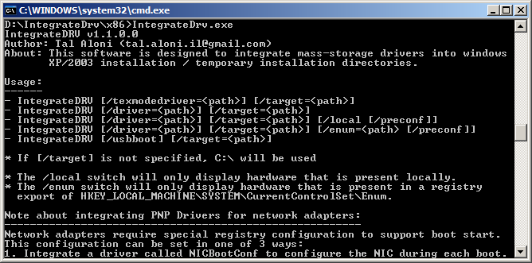

About IntegrateDrv:
===================
IntegrateDrv can integrate mass-storage text-mode or PNP drivers into windows 2000 \ XP \ 2003 setup.  
This program was designed to be operated "in the field", using the original Windows 2000 \ XP \ 2003 installation media, it doesn't require burning a CD.  

What this program can do:
===================================
1. Integrate AHCI / storage (text-mode or PNP) drivers "in the field" before windows installation.
2. Integrate PNP network card drivers so Windows 2000 / XP / 2003 could be installed and run from a network drive (e.g. iSCSI, see [here](http://ipxe.org/appnote/xp_2003_direct_install) for additional information).
3. Set USB 2.0 components to boot-start so Windows XP / 2003 could be installed and run from a USB 2.0 drive. (see [here](http://reboot.pro/topic/18107-integratedrv-install-xp-2003-to-a-usb-30-disk-and-boot-from-it/) for more info)
4. Integrate vendor provided (e.g. AMD) USB 3.0 PNP drivers so Windows XP / 2003 could be installed and run from a USB 3.0 drive. (see [here](http://reboot.pro/topic/18107-integratedrv-install-xp-2003-to-a-usb-30-disk-and-boot-from-it/) for more info)

Can I make a CD with the integrated drivers?
============================================
you can use nLite to create a working directory, and then use IntegrateDrv to integrate the necessary drivers to this working directory using the /target switch, and then create a bootable ISO using nLite.

How this program works:
=======================
What the program does, is to integrate the drivers to the temporary Windows Installation directories (the '$WIN_NT$.~BT' and '$WINT_NT$.~LS' directories that are created when running winnt32), so after you run winnt32 [usually from WinPE] and before you reboot to start the text-mode phase of installation, you run IntegrateDRV, integrate the AHCI / Storage drivers, and voila, windows setup now detects your AHCI controller! (this is the fastest method to integrate text-mode drivers that I know of).  

The software was tested with Intel \ AMD \ nVidia AHCI drivers and with Windows XP \ Server 2003 (both 32 and 64 bit editions),
However, if an issue arises with this utility, let me know and I'll try my best to resolve it (my email is shown in the program help screen)

Contact:
========
If you have any question, feel free to contact me.  
Tal Aloni <tal.aloni.il@gmail.com>